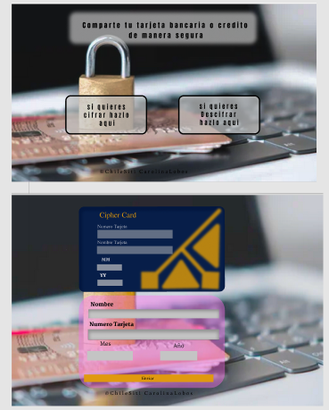

### Definición del producto
* El proyecto será entregado subiendo tu código a GitHub (commit/push) y la
  interfaz será desplegada usando GitHub pages. Si no sabes lo que es GitHub, no
  te preocupes, lo aprenderás durante este proyecto.
  El README.md, cuéntanos cómo pensaste en los usuarios y cuál fue tu proceso
para definir el producto final a nivel de experiencia y de interfaz.
 
// * Mi proyecto se pensó en la necesidad de querer enviar los datos de una tarjeta a otro usuario, sin que sea vulnerada.  Pensé en un prototipo de tarjeta y la estructura de una página, la cual sea fácil para el usuario y que pueda después compartirla. Con la función de cifrar y descifrar los datos ingresados. 

...···...**`PROYECTO`**...···...
## Cipher Card

* se creo diseño de la pagina principal la cual el cliente ingresara y con un boton escojera si su necesidad es cifrar o decifrar una tarjeta.

* segunda pagina: el cliente debe ingresar los datos de la tarjeta a cifrar 

- [ ] ¿Quiénes son los principales usuarios de producto?
   
* Un individuo con la necesidad de cifrar o decifrar una tarjeta especifica

 - [ ] Cuáles son los objetivos de estos usuarios en relación con tu producto.
   
  * enviar una tarjeta para otro destino y poder ocuparla sin que sea interferida por terceras personas.
- [ ] Cómo crees que el producto que estás creando está resolviendo sus problemas.

 * Al cifrar la tarjeta solo el cliente que este sea enviada podrá descifrarla, estáran seguro los datos de esta, la cual no podrá ser vulnerada.
 Enviar una tarjeta para otro destino y poder ocuparla sin que sea interferida por terceras personas.

 *** se creo prototypo de la pagina y la necesidad del usuario ***

* Se creo el diseño de la pagina principal, con dos opciones,(dos botones) la cual el cliente tendra que escoger cual necesita.
##  Aca el codigo html 
<!DOCTYPE html>
<html lang="en">

<head>
    <meta charset="UTF-8">
    <meta http-equiv="X-UA-Compatible" content="IE=edge">
    <meta name="viewport" content="width=device-width, initial-scale=1.0">
    <link rel="stylesheet" href="style1.css">
    <title>Cipher Card</title>

</head>

<body>
    

    <h1>Comparte tu tarjeta Bancaria o credito de manera segura.</h1>

    <section class="container">

        

            <a href="cifrar.html" class="cifrar card">Cifrar AQUI</a>
            <!--# sera el enlase del link y se agrego una clase para los botones-->
            <a href="decifrar.html" class="decifrar card">Decifrar AQUI</a>
            <!---->
        

    </section>
    
</body>

</html>

* ya escogida la opcion,al precionar el boton los direccionara a segunda pagina,

 

 la cual se vera una tarjeta y un campo a llenar, donde el cliente podra ingresar los datos .
 segun lo deceado (cifrar o descifrar).

 al hacer click intantania mente se veran datos del cliente segun el desplazamiento que quiera darle...
 

 

