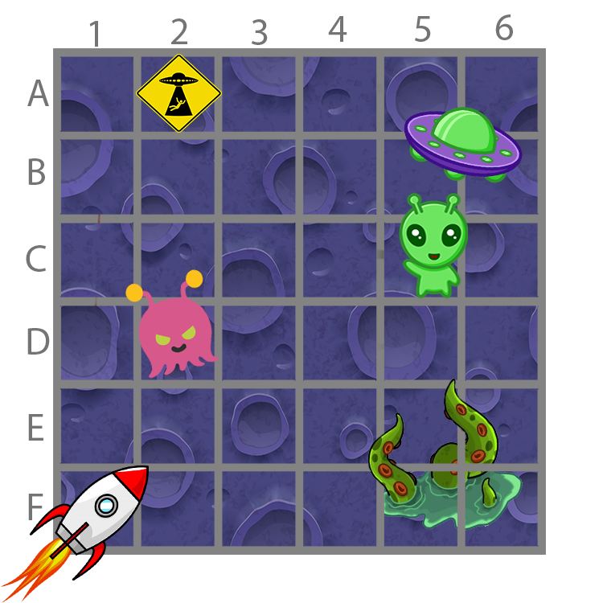
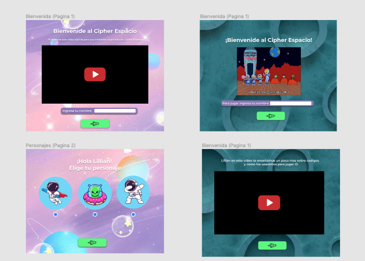
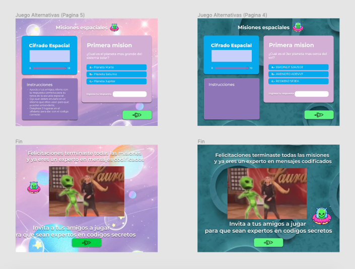
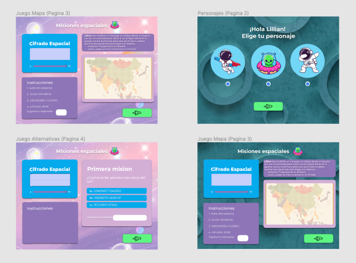

Bienvenides al Cipherespacio!

Esta es una pagina web desarrollada como el primer proyecto para el bootcamp de front-end developer de Laboratoria.
Este proyecto fue desarrollado en 3 sprints, partiendo inicialmente por la planificacion de un prototipo de baja con lapiz y papel que incluia el numero de pantallas y la estructura basica que buscabamos implementar, posteriormente desarrollamos un prototipo en alta en figma el cual incluye dos versiones del proyecto. 
https://www.figma.com/file/kHY5fGWcifuzeS5wP2em4G/Proyecto-Cipher-Espacial?node-id=0%3A1.

Respecto al diseño:
Tomamos la desicion de hacer el juego visualmente simple con una paleta de colores neutra para que el jugador pueda mantener la concentracion en leer las instrucciones, pero con elementos como gifs emojis y musica que mejoran la experiencia del usuario y lo motiva a participar.

Respecto al juego y el usuario:
En esta pagina web vas a encontrar un divertido juego desarrollado en un contexto espacial para aprender mas sobre el cifrado cesar.
Esta pensada para ser usada por personas desde los 10 años en adelante ya que necesita habilidades como la lectoescritura y un nivel usuario en el uso de computador.
Busca cumplir un rol pedagogico ya que el jugador aprendera sobre el sistema solar, aprendera como usar un mapa de coordenadas, podra desarrollar habilidades de comprension lectora en un contexto ludico, puede ser usado en contexto escolar o familiar.
el juego consiste en cuatro pantallas donde encontraras:
 -Una pantalla inicial de bienvenida que le da al jugador informacion y contexto para comprender lo que es el cifrado cesar.
 -Pantalla "primera mision" donde el jugador encontrara lo siguiente:
     -Un mapa de coordenadas tipo ajedrez 
     -Cuatro instrucciones para avanzar en el mapa, la primera a modo de ejemplo estara decifrada y el resto cifradas.
     -Un decifrador cesar en el cual el jugador podra insertar el texto a decifrar y el numero de desplazamientos que necesita.
     -Un cuadro de texto para insertar la coordenada final, si es correcta le dejara avanzar de lo contrario un alert le indicara al jugador que no es la respuesta correcta y le dara una guia de como debe ser la respuesta 'con mayusculas y sin espacios'
     -Un boton para avanzar al siguiente juego.
-Pantalla "segunda mision" donde el jugador encontrara lo siguiente:
     -Instrucciones para responder a una pregunta con el objetivo de 'ayudar a los amigos aliens con la tarea espacial'.
     -Un decifrador cesar en el cual el jugador podra insertar el texto a decifrar y el numero de desplazamientos que necesita.
     -Un cuadro de texto para insertar la respuesta, si es correcta te dejara avanzar de lo contrario un alert le indicara al jugador que no es la respuesta correcta y le dara una guia de como debe ser la respuesta 'con mayusculas y sin espacios'.
     -Un boton para avanzar al siguiente juego.
-Pantalla final de despedida y un mensaje de felicitaciones para el jugador que lo motiva a aprender mas sobre cifrado cesar.
-Un boton que lo regresa a la primera pantalla.

Fotos prototipo figma: 

